# Hotpoor Director · 创作与 AI 对话工作台

一个把无限画布、图片/视频生成、资料对话和本机命令执行放在一起的 Electron 工作台。内置 Python/Tornado 后端与 PostgreSQL，支持 ComfyUI 本地生成、service-inference 多模型调用、素材直传、时间轴以及云端协作。

[对话与代理](#对话与代理模式) · [画布与素材](#无限画布与资源引用关系) · [视频时间轴](#视频时间轴2026-09-18) · [macOS 启动](#macos-源码启动) · [Windows 启动](#windows-开发启动) · [助手使用指南](SKILL.md)

开发过程、验证结果和待办见 [开发日志](DEVELOPMENT_LOG.md)。

首次部署、架构原理与维护排查见 [SKILL.md](SKILL.md)。也可以让代码助手先阅读仓库根目录的 `SKILL.md`，再按你的环境执行部署；该文件不包含个人账号或本地数据。

## 对话与代理模式

工作台顶部点击「对话模式」，在全屏阅读区中选择 AK、模型和运行模式。AK、模型和分类均支持输入搜索；保留已有选择，配置失效时提示重新选择。

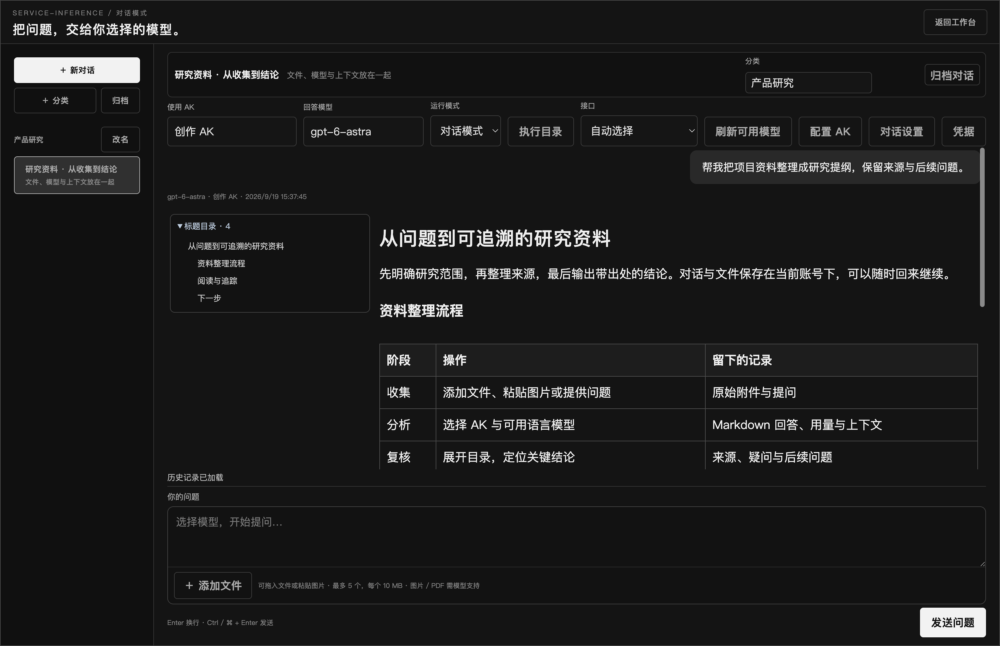

### 日常对话

- **组织对话**：创建分类、修改分类名、归档与恢复；标题和描述可直接点击编辑，自动保存。
- **文件与图片**：在输入框内添加文件、拖入文件或粘贴图片，显示附件卡片并支持移除、图片预览。每次最多 5 个文件，单个 10 MB，合计 20 MB；支持图片、PDF、DOCX 和常见文本/代码文件。图片与 PDF 需要模型支持。
- **阅读回答**：Markdown 标题目录与正文左右排列，点击目录居中定位；表格有细线边框并可横向滚动。完整回答撑满阅读区域，折叠后成为可调整尺寸、内部滚动的卡片。
- **调整显示**：全局五档字体滑条；每条回答的 `Aa` 按钮可单独调字号，复制按钮使用图标。折叠状态、目录展开状态、单条字号与卡片尺寸保存在本机浏览器存储中。
- **检查上下文**：「本次提交」展示初次提问的历史轮次、消息数、文本字数及请求大小，展开查看携带的历史。代理后续工具续接请求不逐次计入这张初始摘要。

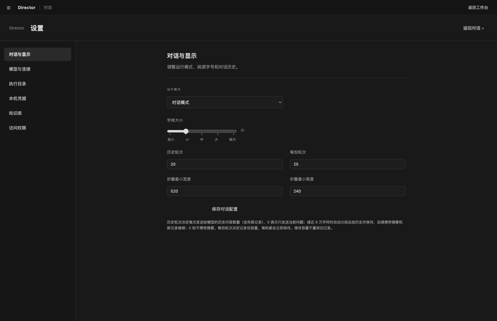

「对话设置」可修改历史轮次和每包轮次，并设置折叠卡片的默认最小宽高。历史轮次为 `0` 时只发送当前问题；失败、中断及其已执行命令结果也按历史轮次进入后续提问，长命令输出会标注截断。不会因为继续提问而由客户端自动重跑已完成命令；模型若再次申请命令仍需确认。

### 代理执行：确认 → 输出 → 继续回答

桌面端选择「代理模式」，接口使用 **Responses**，再通过「执行目录」添加允许的工作目录。模型提出命令后，卡片展示命令、参数、原因与目录，由用户选择「允许执行」或「拒绝」。

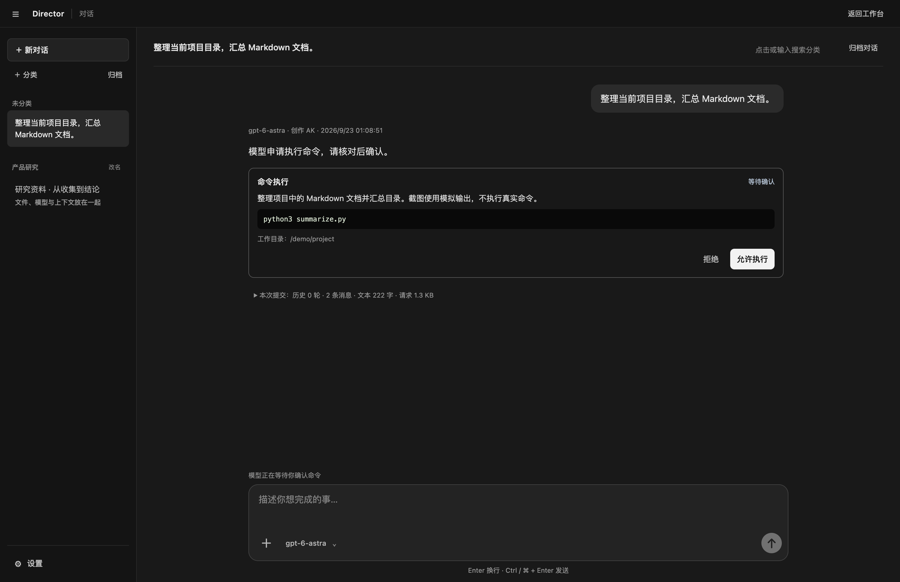

执行期间实时显示标准输出和错误输出，可在卡片内滚动查看；计时按秒、分、时、天逐级显示。点击「停止」中断命令，已有输出保留；macOS/Linux 发送进程组 SIGINT，3 秒后仍未退出则强制终止。这是中断，不支持原地暂停后恢复。当前命令超时为 120 秒，每个输出流最多保留约 1 Mi 字符。

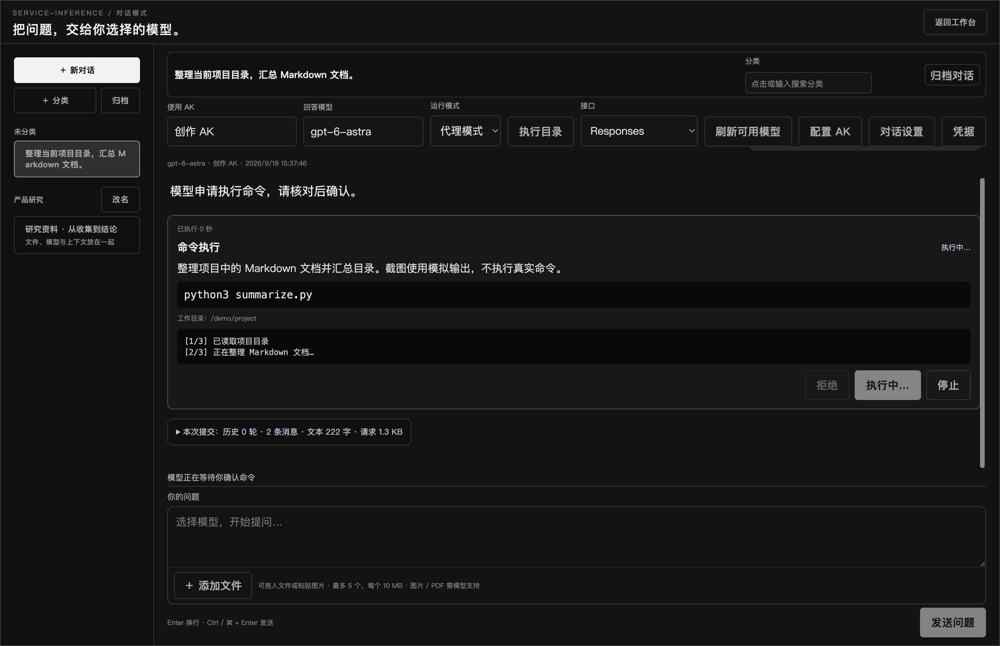

「完全访问 · 永久授权」可为当前对话开启**永久授权，直到手动撤销**：系统确认后，每条新命令倒计时 3 秒自动执行，期间可取消本次自动执行。按钮显示开启状态，点击可撤销；切换对话或关闭对话页取消当前倒计时。撤销后恢复手动确认。授权按对话保存在本机，包含授权时已有的凭据；后来新增的凭据仍会单独询问。此选项不会绕过系统权限，也不会改变工作目录校验。

结果回传后模型可以继续回答或提出下一条命令。新轮次携带完整工具上下文续接，避免只依赖上游响应 ID；执行失败和参数不完整会保留在历史中，方便下一次提问继续处理。参数错误指出具体字段；客户端不自动重新执行本地命令。

**执行边界**：命令在本机、以当前系统用户身份运行。执行目录只校验 `cwd`，不隔离命令参数能访问的其他文件，也不是容器或系统沙箱。网页端没有本机执行桥，不会因此获得服务器命令执行权限。macOS 隐私授权和管理员授权仍由系统管理。

### 本机凭据

「凭据」侧栏支持按名称保存、更新和删除密码，输入框的小眼睛可切换显示。可填写中文用途描述，旧凭据点击「描述」即可修改，无需重新输入密码；名称和描述会提供给模型，描述中不要填写秘密。使用 Electron `safeStorage` 加密后保存于本机；界面和模型通常只获取凭据名称。代理命令通过下面的占位形式申请使用：

```text
env SERVICE_TOKEN={{credential:research_token}} python3 script.py
```

主进程在用户确认或当前对话的有效完全访问授权下将值注入环境变量，输出中原样出现的密码会先脱敏。凭据不作为参数明文传给模型；但获准运行的进程能读取注入的值，这项能力不等同于命令隔离，也不是保存开机密码来自动提权。凭据不随项目云同步。

### 历史与持久化

对话、附件和记录包各自生成 UUID，按 `int(uuid, 16) % 2` 分片。记录包通过 `prev_id` / `next_id` 链接，对话保存 `first_id` / `last_id`；默认每包 25 轮，可调整。每轮及时保存，打包容量不是延迟保存次数。完整历史可加载更早记录，模型默认携带最近 20 轮；初次问题上下文最多 120000 字符。

提交先保存问题，再后台请求模型；相同请求 UUID 防止重复提交。连接中断不自动重发计费请求，先核对服务控制台，再选择继续。对话归创建账号私有，不加入项目分享或项目同步。回答展示实际模型、AK 名称、时间与服务商返回的用量；token 数不等于已确认的单次费用。

### Antigravity / 代码助手接入

让助手先阅读 [SKILL.md](SKILL.md)。现有 CLI 使用 Director 已配置且启用的 service-inference AK，支持模型发现、文本调用、周期费用和余额查询：

```sh
python3 scripts/service-inference-cli.py keys
python3 scripts/service-inference-cli.py models
printf '%s' '请整理这段资料的要点' | python3 scripts/service-inference-cli.py chat --model gpt-6-astra
python3 scripts/service-inference-cli.py cost --period 24h
```

费用查询需要绑定管理 AK。周期账单及按 Key 分摊值不应冒充精确单次价格；详见 [SKILL 的调用与费用说明](SKILL.md#antigravity-调用文本模型与查询费用)。CLI 文本调用不等同于桌面对话历史或本地代理执行。

以上四张新截图采集于 **2026-09-19**，来自当前源码的真实 Electron 渲染，使用独立数据库及模拟模型/命令输出；未调用付费模型、执行截图中展示的命令或读取个人凭据。复现方法见 [截图说明](docs/screenshots/README.md)。

## 双向同步到云端工作站

[云端入口](https://api.xialiwei.com/hotpoor/director)复用本地画布。桌面顶部「同步云端」支持多个域名 / 路径、浏览器登录授权及独立 AK；提交前展示类似 Git 的三方差异，保留双方版本。拉回本地时创建新 UUID 副本，自动回传接收记录，避免循环复制。

操作步骤、资源上传、历史记录及边界见 [云端同步说明](docs/CLOUD-SYNC.md)。

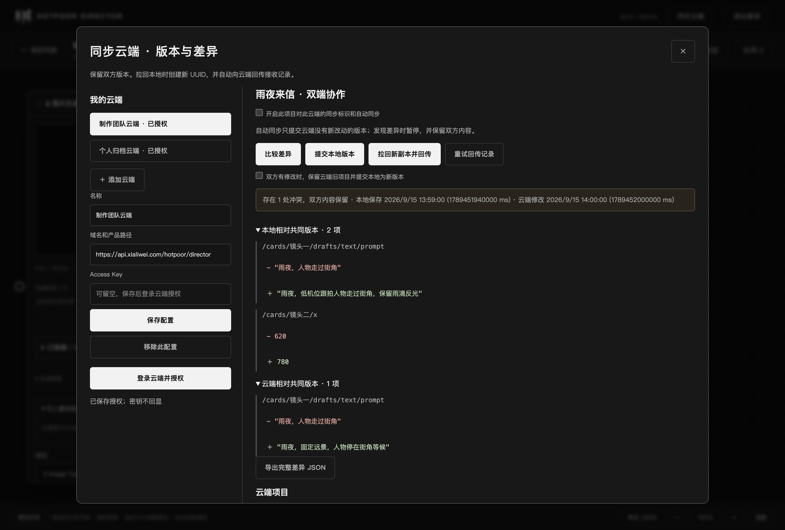

此图为真实 Electron 界面与独立测试数据库，差异内容使用模拟云端数据，不含生产账号或密钥。

云端授权页支持多个具名访问密钥，有效期可选时间段、自定义日历日期或永不过期；已有密钥可单独调整期限或撤销。

## 统一操作提示

操作确认使用应用内最上层深色遮罩，支持取消和键盘操作；桌面启动异常也使用同样样式。

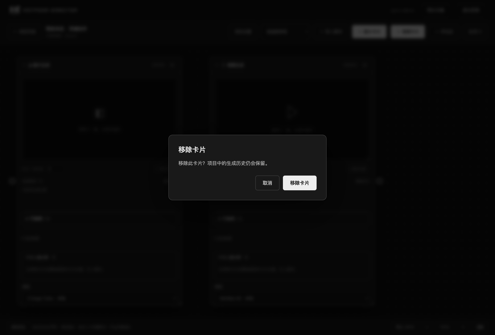

截图来自隔离测试项目，取消与确认删除的保存行为已验证。

## 在线分享与成员

线上打开项目后点击「分享与成员」，按已验证邮箱邀请只读、评论、编辑或管理员；生成权限独立控制，成员使用自己的模型 AK 和云存储。也可创建有期限或永不过期的只读链接，无需登录即可观看；评论需登录并获得评论权限。

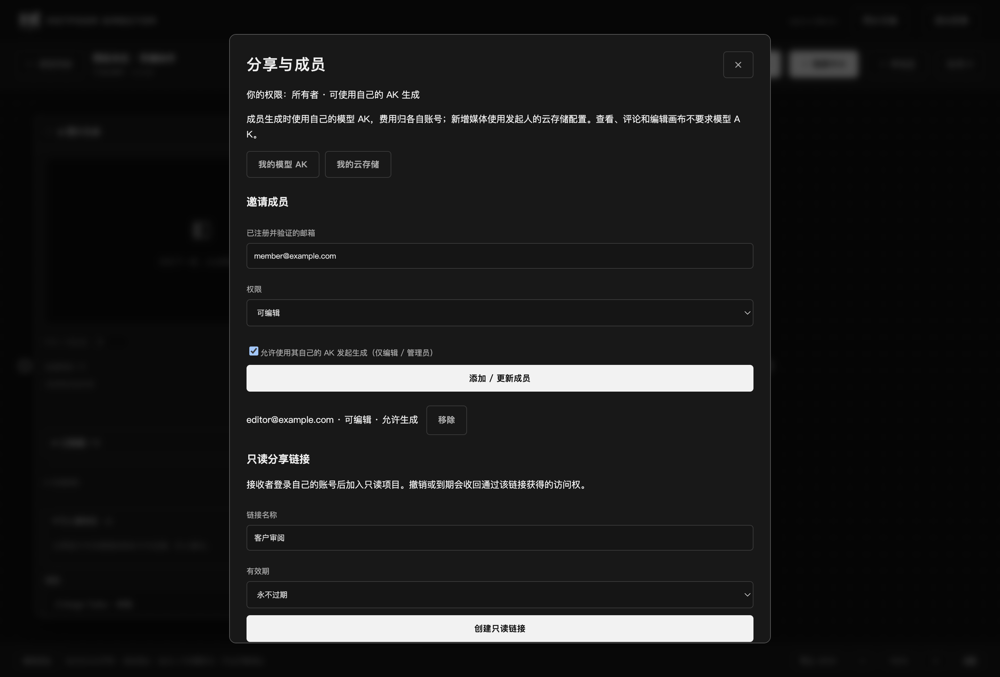

截图使用真实 Electron 界面及模拟成员数据，无生产账号或密钥。具体权限与链接撤销规则见 [协作说明](docs/CLOUD-SYNC.md#在线分享与成员)。

## 画布的 8 个特色

把生成、对比、素材引用和审阅放在同一张无限画布里：

| 特色 | 使用方式 | 截图与说明 |
| --- | --- | --- |
| **1. 多图 PIN、多视频同时对比** | 固定多个图片结果并排看；固定多个视频后联动播放、暂停、进度与倍速。 | [PIN 对比](#视频-pin-同时播放) |
| **2. 评论区按片段讨论** | 指定开始秒数和结束秒数，只播放要讨论的那段视频。 | [片段播放](#评论视频片段播放) |
| **3. 资源引入参考线** | 连接素材、评论和生成卡片，从下游的引入素材库选择参考。 | [引用关系](#无限画布与资源引用关系) |
| **4. 模型对应不同 Tab** | 选择模型后，只展示它支持的创作模式，并提供对应参数指引。 | [模型模式指引](#按模型显示可用-tab) |
| **5. 本地与云端模型混用** | 同一项目中放置 ComfyUI 本地模型和 service-inference 云端模型卡片。 | [混合使用](#按模型显示可用-tab) |
| **6. 云存储多配置** | 七牛、阿里云、腾讯云均可配置；同一厂商也能保存多套配置并切换。 | [存储配置](#云存储多配置列表) |
| **7. 无限画布** | 自由平移、缩放、拖动和调整卡片尺寸，按创作思路组织项目。 | [画布全景](#无限画布与资源引用关系) |
| **8. 图片额外标注，复用原图** | 框选、涂鸦只保存坐标和笔迹；继续引用原图，不额外生成或上传标注图片占用云存储空间。 | [图片标注](#评论关联片段引用与图片标注) |

## 界面截图

以下画布、生成与素材截图为 **2026-09-15 在 macOS 上运行本仓库 Electron 界面时的实际截图**，使用独立测试账号、临时 PostgreSQL 和模拟云服务响应。截图展示已实现的界面与交互；Logo 图片、纯色视频均为测试素材，不代表模型生成质量或真实云服务联通结果。可点击图片查看原始尺寸，来源与更新步骤见 [截图说明](docs/screenshots/README.md)。

### 无限画布与资源引用关系

素材卡片 → 评论区 → 生成卡片：参考线连接上下游，评论附件及其标注可在下游的引入素材库中查看。卡片位置、尺寸和连线随项目保存。

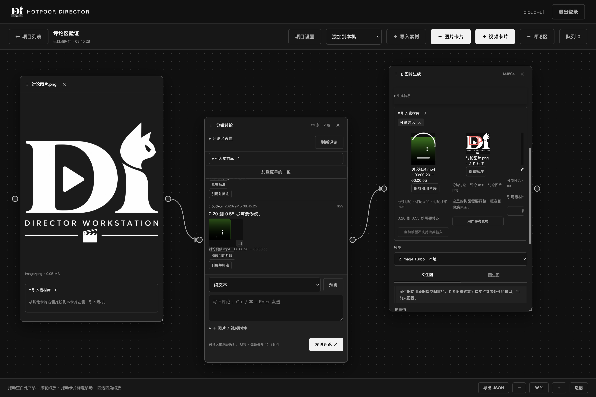

## 日常开发：直接启动源码

双击 `Start_Dev.bat`，或在项目根目录执行 `npm run dev`（`npm start` 也直接运行源码）。Electron 启动 `.venv` 中的 Python 读取 `backend` 源码，无需生成应用 EXE 或重新打包。

- 修改 `backend/web` 下的 HTML、CSS、页面 JS 和图片，保存后窗口自动刷新。
- F12 打开/关闭开发者工具。
- 修改 Python 文件或 `desktop/main.cjs` 后，关闭窗口再启动。
- 如果本项目尚无 `.local/config.json`，但此前桌面版已有账号数据库，会自动使用现有 `userData` 配置。`DIRECTOR_DATA_DIR` 可以显式指定另一套数据。

后面的构建命令只在需要分发安装包时使用，日常修改不需要执行。

## 数据库

同一 PostgreSQL 实例创建三个独立数据库：

| 数据库 | 表 | 字段 |
| --- | --- | --- |
| `hotpoor_director` | `index_login` | `login`, `user_id`, `createtime`, `updatetime` |
| `hotpoor_director1` | `entities`（唯一的用户表） | `block_id`, `body`, `createtime`, `updatetime` |
| `hotpoor_director2` | `entities`（唯一的用户表） | `block_id`, `body`, `createtime`, `updatetime` |

- `block_id` 和 `user_id`：32 个小写十六进制字符的 UUID，无连字符。`block_id` 通常由应用生成，数据库也提供符合本库分片规则的默认 UUID，并校验格式与分片归属。
- `body`：JSONB，默认 `{}`；包含 GIN 索引和 `updatetime` 索引。
- `createtime`、`updatetime`：BIGINT Unix 毫秒时间戳。数据库写入默认值，UPDATE 触发器自动更新 `updatetime` 并保留创建时间。
- `login`：去除两端空格、统一小写、唯一；同一账号映射一个 `user_id`。
- 主库另有 `auth_credentials`（Argon2id 密码哈希）和 `auth_sessions`（随机会话令牌的 SHA-256、用户和有效期）。密码不放入 `index_login` 或实体 JSONB。
- 初始化可重复执行，不清空数据。运行应用使用普通数据库角色，建库使用独立的管理角色。
- `hotpoor_director` 是索引库；另有 `index_entity_commits` 保存跨分片事务的提交决定，不存实体正文。
- 实体统一按 `int(block_id, 16) % 2` 路由：余数 `0` → `hotpoor_director1`，余数 `1` → `hotpoor_director2`。项目、素材、评论、消息包、生成任务及云上传记录均遵循此规则，业务类型不决定数据库。
- 按 ID 的读写只访问对应分片；列表查询汇总两个库，再按时间全局排序。数据库 CHECK 约束拒绝向错误分片写入 UUID。
- 评论等跨分片写入采用 PostgreSQL 两阶段提交，索引库保存提交决定；下一次实体访问或启动时恢复中断事务。为保证恢复与查询一致性，实体事务通过索引库 advisory lock 串行执行，适用于当前本地工作台，尚未做高并发扩展。
- 内置 PostgreSQL 启动参数自动设置 `max_prepared_transactions=32`；外置实例需自行配置该值并重启，最低要求为 `2`。三个库仍是独立数据库，没有主从复制。

### 从旧的业务分库迁移

关闭所有旧版本工作台后启动新版本，或执行 `python -m backend init-db`。初始化会自动检查并迁移放错分片的实体：先在配置目录的 `backups/uuid-shards-*.jsonl` 保存待迁移记录，再逐条复制、核对全部字段，最后删除旧库副本。UUID、JSONB、创建时间和更新时间均保留；迁移可重复执行。若两个库存在同 UUID、不同内容的记录，会停止并报告冲突，不覆盖数据。备份包含实体原始内容，应按工作台数据妥善保存。

已有内置 PostgreSQL 进程若使用旧参数运行，需完全退出工作台并停止该实例后再启动，才能启用两阶段提交。

## macOS 源码启动

准备 Homebrew、Python 3.12 和 Node.js 22.12+ 后，在仓库根目录执行：

```sh
brew install postgresql@18
python3.12 -m venv .venv
.venv/bin/python -m pip install -r requirements.txt
npm ci
mkdir -p runtime/pgsql
ln -s "$(brew --prefix postgresql@18)/bin" runtime/pgsql/bin
npm run db:init
./Start_Dev.command
```

若 `runtime/pgsql/bin` 已存在，先确认它指向可用的 PostgreSQL，无需重复建立链接。数据库由工作台管理，数据保存在项目 `.local/`；无需运行 `brew services start`。后续可双击 `Start_Dev.command` 启动，首次进入后自行创建账号。ComfyUI 在另一台机器上时，通过界面“ComfyUI 配置”填写其局域网 IP 和端口。

## Windows 开发启动

需要 Python 3.12、Node.js 22.12+ 和新版 Microsoft Visual C++ x64 运行库。PostgreSQL 二进制来自 [EDB 官方下载页](https://www.enterprisedb.com/download-postgresql-binaries)，本版使用 18.6。

```powershell
git clone https://github.com/hotpoor/hotpoor_director.git
cd hotpoor_director
powershell -ExecutionPolicy Bypass -File scripts/setup.ps1
npm start
```


如 Python 不在 PATH：`scripts/setup.ps1 -Python '完整路径/python.exe'`。如使用合法的应用本地 VC Runtime 目录，可以加 `-VCRuntimeDir '完整目录'` 将运行库放入 PostgreSQL 的 bin 目录，避免依赖系统旧版 DLL。

首次桌面启动会让你设置自己的账号和密码（12–256 字符），创建后自动登录。没有共享默认账号，创建首个账号的接口需要桌面进程产生的一次性启动凭据，同时使用 XSRF 校验。已有账号后不开放注册。

也可通过交互命令创建账号（密码输入不回显）：

```powershell
npm run user:create
npm run backend
```

单独后端默认在 `http://127.0.0.1:8765`；桌面模式自动分配 HTTP 端口。登录会话有效期 24 小时，退出会删除服务端会话，旧令牌随即失效。接口包括 `/api/login`、`/api/me`、`/api/logout`；POST 请求需要 `_xsrf` Cookie 对应的 `X-XSRFToken` 请求头。

## 配置与数据

开发模式首次运行自动生成 `.local/config.json`；Windows 上目录和文件都设置隐藏属性，并限制为当前用户访问。实际配置、数据库数据、运行组件、构建产物都被 `.gitignore` 排除。仓库仅提交 `config.example.json`，不要在示例里放真实凭据。

安装版本把配置和数据放在 Electron 的 `userData` 目录（Windows 通常为 `%APPDATA%/hotpoor-director`）。数据库目录是其下的 `postgres`，不会放在安装目录中，不会随应用更新覆盖。隐藏文件不是加密；GitHub/Hugging Face token 不会自动复制到本项目。

PostgreSQL 默认绑定 `127.0.0.1:55432`，只允许本机连接，并使用 SCRAM 密码认证。端口占用时在配置中更换端口。`DIRECTOR_DATA_DIR` 可覆盖配置/数据目录，`DIRECTOR_PG_BIN` 可指定 PostgreSQL 二进制目录。

连接已有 PostgreSQL：将配置 `postgres.mode` 改为 `external`，填写地址、管理账号与应用账号。管理账号需有建库、建角色权限；应用不负责启动或停止外部数据库。本版面向本机桌面，不直接暴露 Tornado 到公网。

应用正常退出时关闭它自己启动的数据库；首次写入较多时磁盘刷新可能需要一分钟。若数据库原本已在运行，附加的命令不会将它关闭。

## 构建和验证

```powershell
npm test
npm run pack
npm run dist
```

PyInstaller 将 Python/Tornado 打包为独立后端；Electron Builder 将后端和 PostgreSQL `bin/lib/share` 一起放入 Windows 安装包。构建目录为 `release`。不包含本地配置、账号、数据库数据、pgAdmin 或测试数据库。安装包默认未做代码签名，公开分发前需配置签名及检查第三方运行组件的再分发许可。

集成测试使用 `.test-data` 下的独立临时 PostgreSQL，验证实体字段、时间戳、JSONB、UUID 校验、密码哈希、账号唯一性、XSRF、首次账号保护、登录限流、会话注销和并发写入，不修改开发数据库。

首次版本只验证 Windows x64；macOS/Linux 需准备对应平台的 PostgreSQL 二进制并在目标系统构建。

## 项目 Dashboard 与无限画布

登录后进入自己的项目列表。可创建或编辑主标题、副标题、描述和多张封面（第一张为主封面，最多 20 张）。每个项目由服务端生成 32 位 UUID，创建/更新时间使用数据库毫秒时间戳。

- 项目 JSON 和上传图片元信息按各自 `block_id` 的 UUID 求余分配到两个实体库；图片文件保存在本地配置目录的 `media/` 中。
- 生成任务及历史同样按 UUID 求余分配。两个库各只有一张 `entities` 表，通过 JSON 的 `kind` 区分内容。
- 所有项目、上传图片、生成历史与输出接口都校验当前登录用户；不会接受客户端指定的 owner。
- 画布保存 `viewport` 和 `cards`，卡片有独立 UUID、位置、宽高、类型、各模式参数、选中历史和 pin 列表。编辑后 700ms 自动保存；请求串行，失败保留当前窗口草稿并重试。多窗口修改采用 revision 检查，冲突时停止覆盖，可先导出 JSON 草稿。
- 拖动空白处平移、空白处滚轮缩放；卡片内部滚轮滚动内容，Ctrl+滚轮缩放画布。拖动标题移动卡片，四边及四角均可调整尺寸。底栏可适配全部卡片或恢复 100%。
- 图片与视频卡片先选模型，再显示该模型支持的模式 tab。顶部显示当前结果，pin 数量可调 0–8，历史横向排列，最新在左。点击历史可查看参数/耗时并复用参数。退出或切换项目之前先完成保存。

### 本地生成

先启动 ComfyUI，默认使用本机 `http://127.0.0.1:8188`。项目列表页右上角“ComfyUI 配置”可设置 Host 和 Port、测试连接并保存；配置供本机所有项目共用，保存成功立即生效。有未结束的工作台生成任务时不能切换地址，连接失败保留旧配置。配置保存在工作台数据目录下的隐藏文件 `.comfyui.json`（仅连接配置，不包含账号密码），重启后自动读取。HTTP API 和 WebSocket 进度统一使用该地址。新生成记录保存服务地址，旧记录沿用默认地址，历史媒体始终从生成时的服务读取，因此需保留对应服务及输出文件。模型文件须安装在 ComfyUI 中；Git clone 不会携带模型。界面显示的生成状态来自持久化任务和 ComfyUI 历史，不使用模拟图片或虚构用量。

| 卡片 | 当前可生成 | 暂未配置 |
| --- | --- | --- |
| Z Image Turbo | 文生图；单张原图的 VAE 重绘（图生图） | 独立参考图条件模型/工作流 |
| Z Image 标准版 BF16 | 文生图、单图 VAE 重绘；反向提示词、CFG（默认 40 步 / CFG 4） | 独立参考图条件模型/工作流 |
| MiniMax H3 fl2va | 文生视频；首帧、可选尾帧图生视频，带原生音频，使用已安装的 8-step Turbo LoRA | 多图参考请选择 Ref2VA 模型 |

| H3-Base-Ref2VA FP8 | 图片、视频、音频混合参考共 1–8 项，视频/音频各最多 3 项，默认 20 步；生成带音轨 | 视频参考仅取画面，声音需独立音频输入；默认使用素材开头 |
| LTX-2.5 22B 蒸馏版 INT8 | 文生视频、单首帧图生视频；固定 8＋3 步、2 倍潜空间放大，带音频 | 尾帧/多元素参考暂未接入 |

先选择模型，再显示其支持的模式 tab；未接入的参考模式隐藏，原有草稿保留。Z Image 的图生图是原图重绘，不等同于人物身份保持或多图参考。H3 时长按 24fps 和模型帧数网格向上对齐，实际时长可能略长于输入值。

标准版使用 `diffusion_models/z_image_bf16.safetensors`，与 Turbo 共用 `text_encoders/qwen_3_4b.safetensors` 和 `vae/ae.safetensors`。步数范围 1–60，CFG 范围 1–20；[官方建议](https://blog.comfy.org/p/z-image-day-0-support-in-comfyui)为 30–50 步、CFG 3–5。

LTX 的宽高是最终输出尺寸，须为 64 的倍数，默认 512×320；帧数按 24fps、8k+1 对齐。H3 Ref2VA 默认 512×320、5 秒，建议先用少量参考图；这版不混用 fl2va 的 Turbo LoRA。上游连线的生成图片也可添加到 Ref2VA 的参考列表。

本地 ComfyUI 不返回 token 计费用量，历史中 `usage.tokens` 为 `null`，界面显示“未提供”，并保留模型、提示词、seed、尺寸、步数及实际返回的耗时。输出文件由 ComfyUI 持有，播放/查看时仍需 ComfyUI 运行；工作台通过已认证的接口访问相应任务输出。

素材支持图片 PNG/JPEG/WebP（单张 20MB），视频 MP4/WebM、音频 MP3/WAV/OGG/M4A/WebM（单文件 200MB，播放取决于浏览器对文件编码的支持）。画布顶部“导入素材”按钮、文件拖入和剪贴板文件/图片粘贴均可创建独立素材卡片；卡片可移动、八向缩放，图片可放大，音视频支持分段播放。拖入/粘贴到参考图区域时作为生成输入；项目设置中则添加封面。文件选择器仅由按钮唤起，不显示原生文件 input。普通文字粘贴仍由输入框处理。当前最多 200 张卡片/项目。历史暂未分页，海量记录时需增加分页与缩略图。提交超时不会自动重复入队；先检查 ComfyUI 队列再手动重试。ComfyUI 清空历史或重启后，未回传结果的任务可能需要人工确认。

官方模型说明：[Z Image](https://comfyanonymous.github.io/ComfyUI_examples/z_image/)、[MiniMax H3](https://docs.comfy.org/tutorials/video/minimax/minimax-h3)。

### 按模型显示可用 Tab

先选择模型，再选择该模型支持的创作方式。界面会按模型提供 Tab、参数范围和用法提示：例如本地 Z Image 提供文生图 / 图生图；Seedream 5 Pro 提供交互编辑；Seedream 5 Lite 提供组图生成。未支持的模式不会混在当前模型的 Tab 中。

**本地和云端卡片可以在同一项目、同一画布中混用。** 下图左侧为本地 Z Image，右侧两张为云端 Seedream；各自使用自己的模型参数。云端参考仍须是公网可访问的素材地址，可通过云存储直传获得。

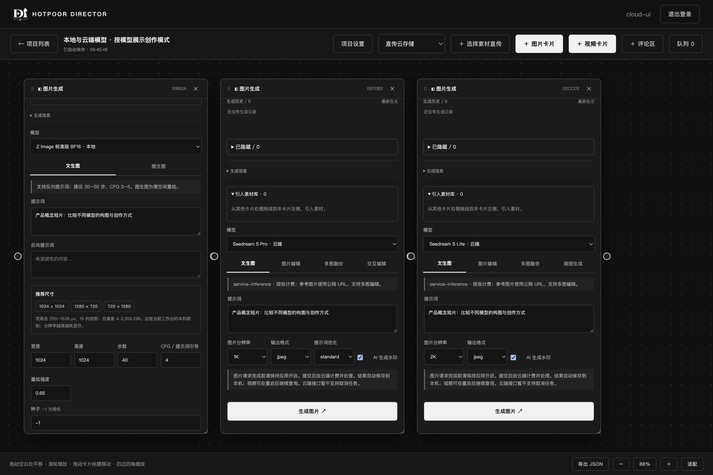

### 开发验证

`npm test` 使用独立临时 PostgreSQL。`scripts/smoke-studio.cjs` 使用 `.test-data/studio-smoke` 数据库（需预先准备测试配置，端口建议 55440），检查项目创建、参数切换、八方向缩放、自动保存、重新打开和窄窗口布局。`scripts/smoke-generation.py` 为可选真实 GPU 测试，会提交一张 256px 图生图，使用上述 UI 测试账号；不自动加入常规测试。

Logo 使用用户提供的透明原图，`scripts/prepare_brand.py` 可使用 Pillow 重建黑色原版、白色反白版和 PNG/ICO。原始透明图不加外圈白边。

### 图片放大预览

点击卡片大图、历史缩略图或 Pin 图片即可进入独立预览。滚轮/加减按钮缩放，拖动平移，100% 查看原尺寸，双击切换原尺寸与适应窗口；可切换同一卡片的历史图片。右上角支持系统全屏，Esc 关闭预览。此操作不会改变画布视角。

设置 `DIRECTOR_MATERIAL_SMOKE=1` 运行 `scripts/smoke-studio.cjs` 可追加素材交互检查，使用本机已生成的 `ComfyUI/output/director/smoke-video_00001_.mp4` 测试文件。

视频模型接口实测可设置 `DIRECTOR_TEST_MODEL=ltx-2.5`、`DIRECTOR_TEST_MODE=image`，或 `DIRECTOR_TEST_MODEL=minimax-h3-ref2va`、`DIRECTOR_TEST_MODE=reference`，运行 `scripts/smoke-generation.py`；使用隔离测试数据库，实际占用 GPU。


### H3 多元素参考

选择 H3-Base-Ref2VA → 多元素参考，用按钮、拖入、粘贴添加素材，或从连线的引入素材库选择（包括上游已生成的视频）。图片、视频、音频分别编号，提示词例如：`保持 <Picture 1> 的人物外观，参考 <Video 1> 的镜头运动，参考 <Audio 1> 的环境声。`

参考视频使用开头片段，按生成时长截取，转换为 24 fps 并按输出像素面积缩小，至少需要 5 帧。视频参考只输入画面；需要声音时请另加音频文件。音频使用开头片段、48kHz 双声道。转换只产生临时副本，原素材不变。参考信息随项目及生成历史保存；不同模型的输入类型由前后端共同校验，封面仍只接受图片。

在上述 H3 GPU 测试环境设置 `DIRECTOR_TEST_MULTIMODAL=1` 可验证图片＋视频＋音频生成（需先有 LTX 测试输出）；`electron scripts/smoke-multimodal.cjs` 检查参考素材 UI、连线引用、自动保存及切换模型。均使用隔离测试数据；不要同时启动使用 `studio-smoke` 数据目录的测试。


### 取消与停止生成

卡片顶部进度条旁提供“取消排队”或“停止生成”。多个任务时展开队列逐个操作，卡片内部滚动不影响顶部按钮。收到停止请求后显示“正在停止”，模型完成当前可中断阶段、队列确认移除后显示“已停止”；模型加载或解码期间可能需要等待。提交阶段取得任务 ID 后才可停止。已完成文件不受重复停止影响，可在历史复用参数重新生成。

需要 ComfyUI 支持按 ID 取消的 `/api/jobs/{id}/cancel` 接口；不支持或服务断开时会报错，不回退为全局停止。可选 `python scripts/smoke-cancel.py` 使用隔离测试账号创建三个 GPU 任务，验证取消排队、运行中断和后继任务正常完成；已有任务时自动退出。`electron scripts/smoke-cancel-ui.cjs` 使用模拟队列验证界面，不中断真实生成。


### 画布汇总队列

画布工具栏“队列”打开右侧列表，汇总当前项目的提交中、生成中、排队中和正在停止任务。可定位对应卡片，或逐项停止。拖动待执行任务、点击 ↑ ↓ 可调整真实执行顺序；其他项目或用户任务占据的槽位保持不变，正在执行的任务不可拖动。列表的“第 N 位”是 ComfyUI 全局待执行位置，可能因其他项目的任务而不连续。队列若已变化会提示刷新重试，不删除重提任务。

安装本地排序扩展：`python scripts/install-queue-extension.py <ComfyUI目录>`，等待 ComfyUI 队列清空后重启。扩展使用当前版本 PromptQueue 的 mutex/heap，升级 ComfyUI 后应运行相关测试；未加载时排序禁用，查看/定位/取消仍可用。队列顺序由运行中的 ComfyUI 持有，不保证跨 ComfyUI 重启保留。

`python scripts/smoke-queue.py` 为可选真实 GPU 测试，只在队列为空时启动；`electron scripts/smoke-queue-ui.cjs` 使用模拟队列检查界面。使用已有隔离测试配置和账号，勿并行启动同一个 studio-smoke 数据目录的测试。

### 模型尺寸与推荐

选择模型后，参数区显示推荐尺寸按钮和当前本机限制：宽高各 256–1536 px；Z Image 以 16 对齐，H3 以 32 对齐，LTX-2.5 最终输出以 64 对齐。图片总像素上限 2,359,296，视频 1,032,192。前后端均校验；范围内的长视频和大量参考仍可能超过显存，应先用低分辨率短片测试。这些限制是当前工作台的配置，不是模型理论最大尺寸。

### 视频 PIN 同时播放

**图片和视频均支持多个 PIN 对比位。** 点击「固定当前」，即可将不同历史结果放到同一张卡片中并排比较；对比位数量可调整，最多 8 个。

下图左侧固定两张图片，右侧固定两段视频并勾选「同时播放」。界面脚本还验证了两个视频的播放、暂停、进度和倍速联动；单张截图本身不展示运动过程。

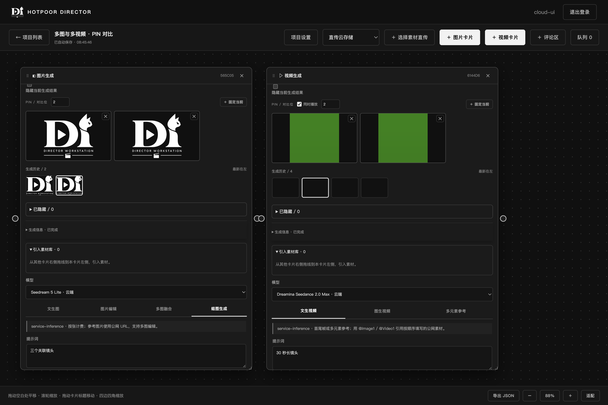

在视频卡片固定至少两段视频后，勾选 PIN 区“同时播放”从开头一起播放；操作任一 PIN 视频的播放/暂停、进度和倍速，会联动其他 PIN 视频。取消勾选恢复独立控制；短片自然播放完毕不停止其余长片。设置自动保存，重新打开项目不自动播放。普通浏览器播放联动不保证逐帧同步，网络解码缓冲可能造成短暂差异。


### 放大预览复制图片

在图片放大/全屏预览区域右键，点击小菜单“复制图片”，即可把完整图片以 PNG 图像写入系统剪贴板；也可使用顶部“复制图片”或 Ctrl+C（选中文字时仍按普通文字复制）。复制保留原始像素尺寸及透明度，不受预览缩放、平移影响。图片未加载成功时不能复制；复制结果或权限错误会显示在预览顶部。

## service-inference 云端图片与视频生成

项目列表右上角的 **service-inference 设置** 提供 API Key 保存、替换、清除和只读连接测试。接口使用一个 `Authorization: Bearer` API Key，不需要额外的 Secret。密钥保存在有效数据目录下的隐藏文件 `.service-inference.json`（源码默认 `.local/.service-inference.json`），文件权限为当前用户读写；接口只返回是否已配置，不回显 Key。此目录已被 Git 忽略。所有生成请求由后端发送，不在画布或历史中保存密钥。有活跃云端任务时不能更换或清除 Key。

在图片或视频卡片中选择带“云端”的模型即可使用；本地 ComfyUI 模型继续保留。

| 类型 | 模型 | 已接入的模式 |
| --- | --- | --- |
| 图片 | Seedream 5 Pro、5 Pro EP、5 Lite、4.5 | 文生图、单张或多张公网参考图编辑；按模型选择分辨率档位 |
| 图片 | GPT Image 1、1 mini、1.5、2、2.5 Sunburst / Flare（含已登记日期版本） | 文生图、单图编辑、多图融合；画质、尺寸、背景、PNG / JPEG / WebP、1–10 张 |
| 视频 | 豆包 / Dreamina Seedance 2.0 Max、Fast Max、Mini Max、2.5 Max | 文生视频、首尾帧、多元素参考；480p / 720p、画幅、4–15 秒和音频开关 |
| 视频 | MiniMax H3 | 文生视频、公网参考图生视频；768P / 2K、4–15 秒与画幅 |

参考素材填写公开可访问的 HTTP(S) 文件直链，每行一项；也可点击「选择文件直传」或把文件拖入对应字段，使用已配置的云存储自动获得公网 URL。上游素材库的「用作参考素材」同样使用客户端直传。云端不能直接访问 ComfyUI 内网 URL。Seedance 多元素参考按图片、视频、音频分别编号，提示词使用 `@Image1` / `@Video1`；首尾帧有独立字段。MiniMax 仅接入文档明确给出结构的图片参考。本版 Seedance 参考最多 12 项、视频/音频各 3 项，MiniMax 图片最多 5 项，为工作台输入上限，仍以服务端的模型校验为准。

GPT 图片接口按用户确认的 OpenAI 兼容协议接入：文字生成走 `/v1/images/generations`，参考图与编辑走 `/v1/images/edits` 的 JSON `images: [{image_url}]`。最多 16 张参考图；透明背景需 PNG 或 WebP；2.5 系列额外支持 xhigh / max 画质。模型仍按所选 AK 的 `/v1/models` 权限显示，修改后需重启本地客户端并刷新模型。协议依据 [OpenAI 图片生成](https://developers.openai.com/api/reference/resources/images/methods/generate) 与 [图片编辑](https://developers.openai.com/api/reference/resources/images/methods/edit)。

GPT 与 Seedream 使用同步图片接口（请求在后台执行），请在图片请求完成前保持应用开启。视频提交后保存远端任务 ID，Seedance 每 10 秒、MiniMax 每 15 秒查询一次；应用重启会继续查询已有 ID，不会重新发起生成。生成完成后自动保存图片/视频到数据目录 `generated/`，历史播放、图片预览、PIN 和视频提帧使用带登录验证的本地结果接口，视频支持 Range 拖动播放。每个结果限制 210 MB；返回的用量按服务商原值记录，未返回 token 时不虚构。

云端接口文档没有取消或排序操作，因此这类任务只能查看和定位，不显示可用的取消/排序按钮；ComfyUI 的任务操作保持原有行为。提交超时或应用在提交期间关闭时，不自动重试付费请求：请到服务控制台核对受理状态。视频查询或结果下载的暂时性错误会自动重试；鉴权失效、无权限或任务不存在时会停止查询并显示错误。图片结果保存失败需在服务控制台核对；本版未接入组图、流式响应或精确像素尺寸输入。

接口依据：用户提供的 [Seedream](https://console.service-inference.ai/docs/seedream)、[豆包 Seedance Max](https://console.service-inference.ai/docs/doubao-seedance-max)、[Dreamina Seedance Max](https://console.service-inference.ai/docs/seedance-max)、[MiniMax H3](https://console.service-inference.ai/docs/minimax) 文档。生成按服务商规则计费；设置里的连接测试仅查询任务列表，不触发生成。

验证：`npm test`；`node_modules/.bin/electron scripts/smoke-inference.cjs` 使用独立临时数据库、测试 Key 和模拟云端响应，检查设置、四类模型生成路径、结果保存、视频 Range、自动保存与重开、窄窗口。测试不读取真实 Key，不调用付费生成接口。


### 云存储直传

项目列表 → **云存储直传设置**，同一窗口左侧显示配置列表，右侧显示编辑表单。同一厂商可保存多套配置；点击「＋ 添加配置」命名并填写，使用「仅保存」或「保存并启用」。列表中的单选按钮决定后续上传使用哪套配置。

| 厂商 | 凭据 | Bucket / 域名 |
| --- | --- | --- |
| 七牛 Kodo | AccessKey / SecretKey | 空间名称；必须填写绑定的公网访问域名 |
| 阿里云 OSS | AccessKeyId / AccessKeySecret | Bucket 名称；域名可选 |
| 腾讯云 COS | SecretId / SecretKey | Bucket 完整名称（包含 APPID 后缀）；域名可选 |

Region 可选择或填写，Endpoint 按地域自动生成，也可填写官方 HTTPS Endpoint。默认服务地址不包含 Bucket；自定义 CDN 域名填在「访问域名」。七牛地域地址依据[官方区域表](https://developer.qiniu.com/kodo/1671/region-endpoint-fq)。

文件字节从 Electron 渲染器直接发往云存储：七牛使用限定单对象的短时上传 Token + 表单 POST；OSS 使用 V4 签名 PUT，COS 使用签名 PUT。后端只接收文件名、类型、大小，签发 10 分钟凭证，并查询对象元信息及公网 HEAD；不代理云上传文件。确认通过才将公网 URL 填入模型参考字段。图片上限 20 MB，视频与音频 200 MB。单次直传，无分片续传；失败可在该参考字段重试，已成功上传但确认失败时仅重新确认。

在空间控制台配置 CORS：允许来源 `*`，方法 `PUT`、`POST`、`HEAD`，请求头 `Content-Type`（或 `*`）。客户端不发送登录 Cookie。需有对象上传和读取权限；「验证空间」额外需要查询空间信息权限。该验证不上传文件，不代表 CORS 或域名已可用。访问域名应允许公网读取、正确绑定 DNS，且防盗链允许云端获取素材。私有空间可使用已配置的公开 CDN；本版不签发下载链接，也不修改空间 ACL。

长期密钥保存在有效数据目录下 `.cloud-storage.json`（源码为 `.local/.cloud-storage.json`，文件权限 0600），不通过设置接口回显、不进入项目参数。清除厂商配置不会删除云端文件。需要实际厂商凭据、权限与 CORS 配好后，才能完成真实上传验证。

路径前缀可按厂商分别填写，例如 `projects/demo/images`，访问 URL 为 `<访问域名>/projects/demo/images/<唯一文件名>`。留空上传至 Bucket 根目录，首尾及重复斜杠自动整理。仅影响新上传对象，不移动已有文件或修改历史 URL。

画布工具栏的「添加到本机 / 直传云存储」选择素材添加方式。直传模式对文件选择、拖入空白画布和粘贴均生效；上传成功生成云素材卡片，支持预览、复制公网 URL、连接云端生成卡片作为参考，重开项目仍保留。云素材无需再上传到本地；ComfyUI 参考仍使用本地素材模式。

新直传对象使用文件内容 MD5 作为文件名（带类型扩展名），例如 `<域名>/<前缀>/<项目 block_id>/<MD5>.png`。同一项目、存储配置下的相同内容再次添加，会复用已完成的上传记录，只添加素材卡片，不重复传输文件。MD5 在客户端分块计算，原始文件名不参与去重；不迁移旧对象。

项目 block_id 同时用于对象目录与项目内去重，前缀留空时为 `<域名>/<项目 block_id>/<MD5>.<后缀>`。公网确认支持最多 4 次重定向并校验每一跳的公网地址，保存最终 URL。网络环境使用 SOCKS 代理时由 PySocks 提供 SDK 支持。

云存储直传时右下角显示文件名、批次序号与阶段进度：MD5 校验百分比 → 重复检查 → 实际传输百分比与字节数 → 公网确认 → 完成或复用。未知耗时阶段显示等待状态，错误原因保留在进度面板，完成或失败后可关闭。

### Seedream 创作模式

- 所有 Seedream：文生图、图片编辑、多图融合（至少两张图，按「图1」「图2」描述）。
- Pro / Pro EP：另有交互编辑，可上传已圈选/标记的参考图或在提示词中输入 `<point>` / `<bbox>` 坐标；目前无内置画笔。可选 standard / fast 提示词优化。
- Lite / 4.5：另有组图生成，设置最多张数 1–15，参考图数量与输出上限之和不能超过 15。实际张数由模型决定，返回的全部图片在组图缩略图中查看，并按提交时选择保存到本机或云存储。
- 输出格式按模型提供（4.5 仅 JPEG），水印可配置。本版组图使用同步响应，未接 SSE 流式输出。能力依据用户提供的 Seedream API 文档。

云素材预览仍直接加载公网图片；复制图片时通过本机鉴权接口读取当前账号已确认的原图，并校验大小与 MD5，避免跨域 Canvas 污染。此读取仅用于复制，不改变客户端直传上传路径。

Seedance 2.5（豆包 / Dreamina）的工作台时长范围为 4–30 秒；2.0 系列及 MiniMax 保留原来的 4–15 秒。2.5 上限依据[官方模型说明](https://seed.bytedance.com/zh/seedance2_5)，实际 service-inference 长视频受理情况以服务端为准。

### 生成记录与费用汇总

画布底部「生成记录 / 费用汇总」查询当前项目全部生成记录，包含已隐藏结果与已移除卡片的历史。支持日期、图片/视频、状态筛选，以及模型、Key 名称、提示词和任务 ID 搜索。展示逐条费用、本次折算单价及按模型、币种分别统计的已知开销；云端费用未知单独计数，本地电费/设备成本未统计。

费用来自服务响应或控制台真实账单，不使用写死的模型价格。旧视频在 [service-inference 日志](https://console.service-inference.ai/logs) 选择日期范围，「下载 → NDJSON」，再用工作台「导入费用账单」回填。导入通过 `metadata.taskId` 与云端任务 ID、模型共同匹配，只更新当前项目；重复导入不会重复累计，也不按相近时间猜测匹配。新图片若服务响应包含 `X-Request-Id`，会保存请求 ID 用于账单匹配；缺少 ID 的旧图片不会自动匹配。

视频生成信息提供「查询费用」，使用原任务 Key 只读查询原接口版本的任务响应；任务接口未返回费用时保留已有账单费用并提示导入。生成返回的费用在转存结果前保存，下载失败不会丢失已知开销。

2026-09-17 核对已登录控制台：`GET /user/logs?from=…&to=…&tz=…&limit=…&cursor=…` 返回 `records` / `nextCursor`，单条为 `GET /user/logs/record?id=…`，汇总为 `GET /user/logs/summary`，导出为 `GET /user/logs/export`（默认 NDJSON，`format=csv` 为 CSV）。视频生成记录的 `cost` 为 USD 费用，`usage.video_tokens` 为视频 Tokens，`metadata.taskId` 用于关联视频；GET 任务轮询记录费用可为空。控制台通过网页登录会话访问这些接口，当前生成 Key 调用返回 403，因此本版提供账单导入，尚未自动同步控制台日志。

## 多 service-inference Key

设置页将「生成 AK」与「管理 AK」分为独立配置，两者分别支持最多 30 个命名配置。每张图片/视频生成卡片可直接选择生成 AK，多张卡片可同时使用不同 AK；模型列表按卡片所选 AK 筛选，选择保存于项目。设置页生成 AK 用复选框多选启用，卡片只可选择已启用的 AK；旧版配置默认全部启用，保留每张卡片的选择。管理 AK 同样多选启用，组织费用查询分别展示各组织并计算合计；同一组织多个 AK 去重。管理 AK 为 `sk-mgmt-v1-…`，保存/验证只读请求 `/manage/whoami`，配置独立保存于 `.service-inference-management.json`（0600，不回显凭据）。生成 AK 仍保存于 `.service-inference.json`；两类凭据不能混填。

每个生成 AK 编辑时选择「绑定管理 AK」，多个生成 AK 可共用一个管理 AK。现有未绑定配置仍可生成，费用查询前需要补选绑定。绑定查询固定使用该管理 AK，即使更改其他管理 AK 的启用状态也不会改变绑定凭据；绑定的管理 AK 停用时查询会提示先启用；缺少绑定不会回退到另一管理 AK。被绑定的管理 AK 不能删除或换到不同组织，需要先改绑生成 AK。

「查询绑定管理 AK 的费用汇总」直接调用管理 API 的 `/manage/cost/summary`、`/manage/cost/breakdown` 与 `/manage/cost/by-key`，展示整个组织的 USD 总费用、按模型汇总和按生成 Key 分摊的近似费用，支持周期或 UTC 日期范围。这些组织汇总与当前项目的逐条费用统计范围不同；`unpricedCount` 大于零时提示汇总尚不完整。用户提供的 Management API 文档没有单条请求/视频费用接口，所以管理 AK 不用于调用网页登录的 `/user/logs/record`，也不把分摊费用当成单视频账单。

下图展示两个 Key 配置、当前启用项和按 Key 显示的模型列表；密钥输入框不会回显已保存的值。图中配置与模型响应均来自隔离测试。

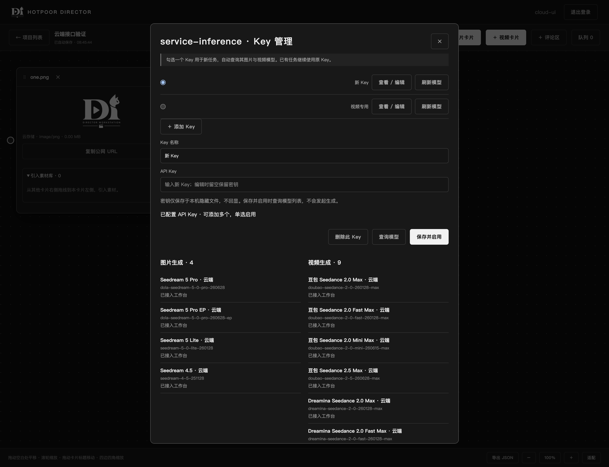

设置中可添加、命名、编辑及删除多个 Key，单选一个用于新任务。保存、切换与「刷新模型」均调用该 Key 的 `/v1/models`，分别显示图片与视频模型；API 可见但尚未接入工作台的模型会注明，不能在生成卡片中选择。图片与视频卡片只提供当前 Key 已列出且工作台已接入的模型；旧卡片的不可用模型保留显示并禁用生成，避免修改已保存的创作参数。

旧单 Key 隐藏配置自动兼容为「原有 Key」，仍使用 `.local/.service-inference.json`、0600 权限，不回显凭据。任务保存 Key 的内部 ID 与名称，后续查询固定使用该 Key。切换 Key 不影响正在执行的任务；被活动任务使用的密钥暂不能替换或删除。模型列表是账号可见性结果，不代表实时余额、服务容量或最终生成成功。

### ComfyUI 局域网访问

在 ComfyUI 原启动命令后添加 `--listen 0.0.0.0 --port 8188`，等待运行和排队任务结束、同步生成历史后重启。Windows 防火墙可按 ComfyUI 实际 Python 程序、有线网卡、专用网络和 `LocalSubnet` 限定 TCP 8188 入站。其他设备访问 `http://服务机器的局域网IP:8188`，工作台连接配置中的 Host 填该 IP；服务机器自身仍可使用 `127.0.0.1`。

ComfyUI 默认没有账号保护，只向可信局域网开放，不需要路由器公网端口映射。此设置只开放 ComfyUI，不开放工作台 Tornado 或 PostgreSQL。局域网设备需安装自己的工作台，或使用 ComfyUI 自带网页；本地队列排序扩展目前仅接受回环请求，因此远程工作台的队列拖动排序暂不支持。

### 评论区卡片

画布工具栏点击「＋ 评论区」，创建独立 `chat_id`。设置中可重命名并填写每包 25–100 条（默认 50）。评论每次发送即落库，尾包未满时追加，满后创建新包；修改条数只影响后续新包，不重写历史。顶部「刷新评论」获取最新记录，「加载更早的一包」向前读取。

评论支持纯文本、Markdown、HTML 源码预览及 `contenteditable` 富文本（粗体、斜体、下划线、列表）。Markdown 使用 Marked 18.0.13，HTML / 富文本使用 DOMPurify 3.4.15 的标签和属性白名单渲染；不执行脚本、事件、表单或自定义 CSS。第三方浏览器文件及许可证随源码保存在 `backend/web/vendor`，不依赖运行时 CDN。正文最多 100000 字符，草稿保存在本机当前账号的浏览器存储中，发送成功后清空。

每条评论最多 10 个图片/视频附件，可选择文件、拖入或粘贴，选择上传到本机或已配置的云存储；也可填写 HTTP / HTTPS 直链并指定图片/视频类型。引用下拉框提供本项目画布的图片/视频素材卡片及已完成的生成结果，保存引用而不复制文件。图片最多 20 MB，视频最多 200 MB；文件类型沿用现有上传限制。地址附件保留原始地址，需要目标可访问且浏览器支持对应编码。

评论区和消息包分别按自身 UUID 求余存放于两个库的 `entities` 中，不塞入画布 JSON：

- `kind=chat`：`block_id` 即 `chat_id`，记录项目、所有者、分包大小、头尾包 ID 和评论/包计数。
- `kind=chat_pack`：独立 entity，含 `chat_id`、`prev_id`、`next_id`、固定 `capacity` 和 `messages` 数组。结构为 `chat → head ↔ … ↔ tail`。
- 发送通过行锁和事务同时更新包与链指针，消息 UUID 实现丢失响应后的幂等重试；按登录用户和项目校验线程、附件及生成结果。

移除评论区卡片保留数据库中的评论；当前不提供删除评论或多用户共享。评论上传/发送进行中不可退出项目。隔离验证命令：`node_modules/.bin/electron scripts/smoke-comments.cjs`（Windows 使用 `electron.cmd`），覆盖四种文字模式、媒体文件/地址/引用、分包翻页和草稿重开；后端回归包含并发、幂等和越权检查。


### 云存储多配置列表

下图展示七牛、阿里云和腾讯云配置列表，以及独立的编辑表单；域名和 Bucket 均为测试示例。

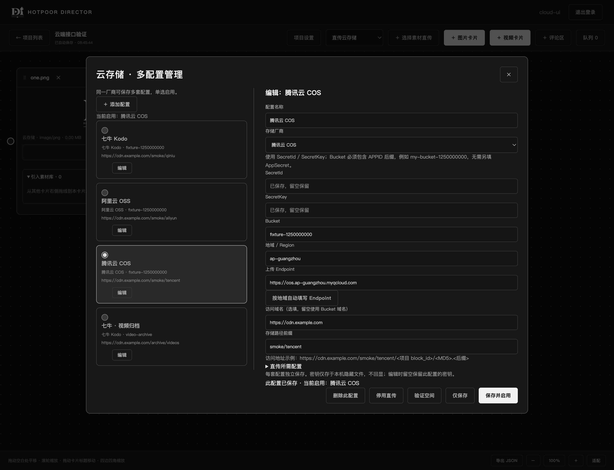

每套配置有独立 ID、名称、厂商、密钥、Bucket、地域、Endpoint、域名和路径前缀，最多保存 50 套。原有按厂商保存的配置自动兼容为列表项，原路径及启用状态保留。编辑时密钥留空保留当前配置的密钥；新配置须填写自己的密钥，不借用同厂商其他配置。切换表单厂商会开始添加一套新配置。

列表同时展示名称、厂商、Bucket、访问域名和前缀；点击「编辑」不会改变当前启用项。「仅保存」保留当前上传选择，单选或「保存并启用」切换新上传目标，「停用直传」保留所有配置。「删除此配置」只删除本机配置，不删除云端文件。

上传记录绑定发起时的配置 ID，切换启用项不影响正在上传文件的确认；修改或删除该配置的连接参数会使尚未确认的上传要求恢复原配置后重试。配置改名不改变文件去重指纹，已有素材 URL 和项目引用保留。密钥仍只保存在隐藏文件 `.local/.cloud-storage.json` 中，不经设置接口回显。


### 评论视频片段播放

在评论附件中选择「引用时间段」，填写开始和结束秒数，或使用当前播放位置设置边界。点击「播放选段」会从开始位置播放，到结束位置暂停；保存后可在评论及下游素材库中回看片段。

下图使用 1 秒测试视频，指定 **0.20–0.55 秒**。只记录起止时间并引用原视频，不裁剪生成新文件；实际片段边界受浏览器播放时序和视频关键帧影响。

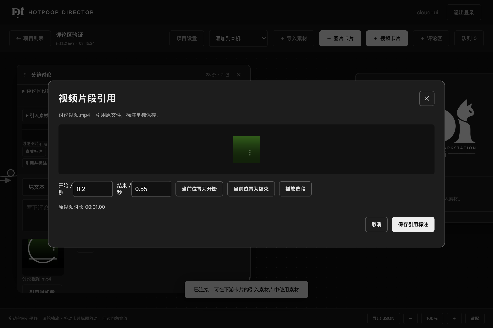

### 评论关联、片段引用与图片标注

**标注与原图分开保存，不为每次标注新增一张云存储图片。** 框选、涂鸦的坐标和笔迹保存于评论附件的 JSON 数据中，原素材 ID / URL 保持不变；可撤销、清空或再次引用标注。下图红色标记由应用内实际鼠标操作绘制。

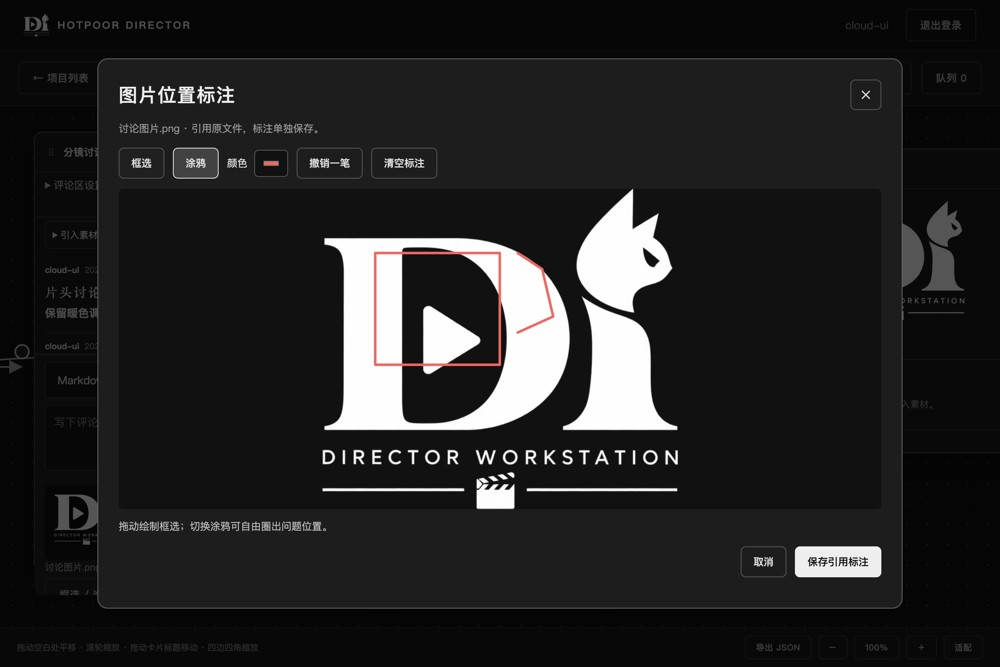

评论卡片现在与其他卡片一样具有左右连接点。将图片/视频素材或生成卡片的右侧连到评论左侧，在「引入素材库」点击「引用并评论」；再把评论右侧连到下游卡片，即可在下游素材库查看评论附件、说明和标注。连接保存于原画布连线结构，支持鼠标拖线及连接点键盘 Enter。评论历史的素材索引按包加载并缓存已满包，不要求先手动展开所有旧评论，断开连线不删除评论或附件。

评论草稿中的每个附件提供「框选 / 涂鸦」或「引用时间段」。图片标注编辑器以 SVG 叠加框线和自由笔迹，支持颜色、撤销与清空；数据库只保存 0–1 相对坐标和受限形状数据，不接受可执行 SVG。缩放图片和重新打开后保持原位置，最多 50 处标注、4000 个笔迹点。

视频引用可填写起止秒数，或把当前播放位置设为开始/结束，预览会从开始播放并在结束处暂停。发送后评论和下游素材库均显示时间范围及「播放引用片段」。已有评论附件可以点击「引用并标注」再次讨论。

标注保存在评论附件的 `review` 字段：图片使用 `{kind:"image",shapes:[…]}`，视频使用 `{kind:"video",start:秒,end:秒}`。继续引用原素材 ID 或 URL，不生成裁剪视频、合成图片或重新上传文件。下游选择「用作参考素材」时仍使用原素材；评论标注是审阅层，不会自动烘焙为模型输入图像或截取生成参考视频。视频需原地址支持访问、浏览器解码及定位，选段播放精度受媒体关键帧和浏览器播放时序影响。

### 云端生成进度与结果保存

桌面工具栏的“添加到本机 / 直传云存储”同时决定新提交的 service-inference 生成结果保存位置；在线版固定使用云存储。任务提交时记录配置 ID 与指纹，切换启用配置不会改变正在生成任务的目的地。修改或删除原配置时明确提示恢复原配置，不静默落盘到本机。

准备阶段每两秒查询一次上游；上游返回 `task.progress` 或 `task.metadata.progress` 的计数、阶段时持续展示。未提供逐项进度时明确显示“上游尚未提供逐项进度”和最近查询时间，不推算百分比。结果分为读取、上传、对象及公网校验，显示文件序号和实际读取 / 发送字节；上传完成须校验通过后才标记任务完成。

视频生成完成后持久化结果地址；转存失败只重试保存，重启后继续处理同一任务，不重新计费生成。错误区分查询、读取、上传和校验。已存在的本地历史文件不自动迁移。

七牛视频结果优先由对象存储直接抓取，使用项目目录下的任务ID/输出序号稳定命名，并验证对象与公网读取；抓取不可用时回退到内存转传。直接抓取不经过应用计算SHA-256，不伪造校验值。其他厂商及图片使用MD5命名的流式转传，大文件传输上限放宽到30分钟。

### 视频时间轴（2026-09-18）

打开项目，在画布底部点击「时间轴」。选择画布素材或已完成的视频结果，点击「接到末尾」按真实时长连续追加；在时间轴上滚轮横向移动，缩放滑块或 Ctrl/⌘ + 滚轮改变秒数比例。拖动片段移动，拖动两端裁剪，选择后可输入精确开始秒数、持续秒数和素材入点。默认磁吸到相邻片段边缘、字幕边缘、播放线及开始线，按住 Alt 暂停磁吸。

重叠区由后放置或拖动的片段覆盖，也可点击「置于覆盖顶层」。覆盖保留下层内容，不修改原视频文件。金色开始线决定播放起点，可拖动标尺上的金色标记、输入秒数或将当前播放位置设为开始线；红色播放线表示预览位置，点击标尺或轨道空白处定位。

「＋ 字幕」默认绑定所选/当前视频；跟随字幕使用片内偏移，随视频移动，并仅在绑定视频未被覆盖时显示。可切换「绝对定位」固定在全局时间轴上。跟随字幕必须处于绑定片段范围内，裁剪前可先调整字幕；移除视频会把绑定字幕转为绝对定位并保留其位置。

时间轴随项目自动保存，桌面与线上使用同一实现，云端同步新副本会重写视频、字幕及素材引用。只读成员可查看和播放。当前是剪辑编排与浏览器预览，尚不提供成片渲染/导出；视频切换和定位精度受浏览器解码与网络加载影响。

验证：`node_modules/.bin/electron scripts/smoke-timeline.cjs` 使用独立数据库，覆盖实际鼠标拖动、磁吸、重叠、裁剪、字幕两种定位、缩放横滚、保存重开与预览。

卡片标题旁的「✎」可重命名图片生成、视频生成及素材卡片（评论区仍在评论区设置中改名）。时间轴素材选择优先展示卡片名，生成视频同时显示生成时间、结果序号及短批次 ID。选择时间轴片段后可填写独立「片段名」，留空时跟随来源名称；轨道显示原视频取用起止秒数，详情保留完整来源。改名不改变素材文件名、引用或剪辑位置，随项目保存与云端同步。

#### 重叠错层与多时间轴 PIN 对比

重叠的视频自动抬到上方独立一行，起点竖线连回底层；非重叠片段可共用一行，接触边界不算重叠。覆盖优先级仍为后放置优先。

「＋ 新时间轴」创建独立编排，最多 8 个；也可「复制时间轴」比较剪辑方案。点击时间轴名称改名。副本具有独立片段/字幕 ID，跟随字幕仍绑定对应副本片段；时间轴随项目保存及云端同步。收起的时间轴可用底部「时间轴」收起全部后重新打开恢复。

每条轴可独立播放。勾选「同步播放 / 定位」后，以相同绝对秒数联动播放、暂停和定位；不同长度的时间轴在无片段处显示空画面。收起某条轴会停止该轴，其余轴继续播放。

「PIN 对比窗」可拖动标题栏移动、拖动右下角调整大小；用数字输入「行 × 列」自定义网格，例如 1×3、2×3、3×3；行列各接受 1–16 的整数，最多 PIN 当前项目全部 8 条时间轴。同步播放多轴时会打开对比窗。各轴的「PIN 预览 / 已 PIN」决定参与对比的画面。声音可选择任一时间轴、全部混音或全部静音，窗口内外的声音选择同步；播放器在小预览和 PIN 窗间移动，不产生重复声音。视窗/PIN/声音选择属于当前浏览状态，编排数据持久保存。浏览器解码、缓冲和关键帧仍影响画面级同步精度。

声音默认「跟随播放轴」：独立播放时听最后发起播放的轴，同步播放时听发起同步播放的轴；也可手动固定某轴、混音或静音。预览右下角的「音源 / 静音」标记显示当前路由。2026-09-18 已修复第二轴动态编辑控件绑定问题，拖动、裁剪与片段命名对各轴独立生效。

同一服务中的同一项目支持约每秒检查更新：保存后的卡片和时间轴自动更新到其他窗口，不同位置的修改进行三方合并；同一字段冲突保留当前草稿并提示。鼠标进入或焦点进入卡片／时间轴时申请独占编辑锁，其他窗口显示编辑者账号（同账号不同窗口也互斥）。离开且保存完成后释放；关闭或断网停止续租，锁最多 15 秒过期。播放预览仍可使用。客户端与线上使用同一实现；本机项目副本与云端副本仍通过已有同步功能管理。
