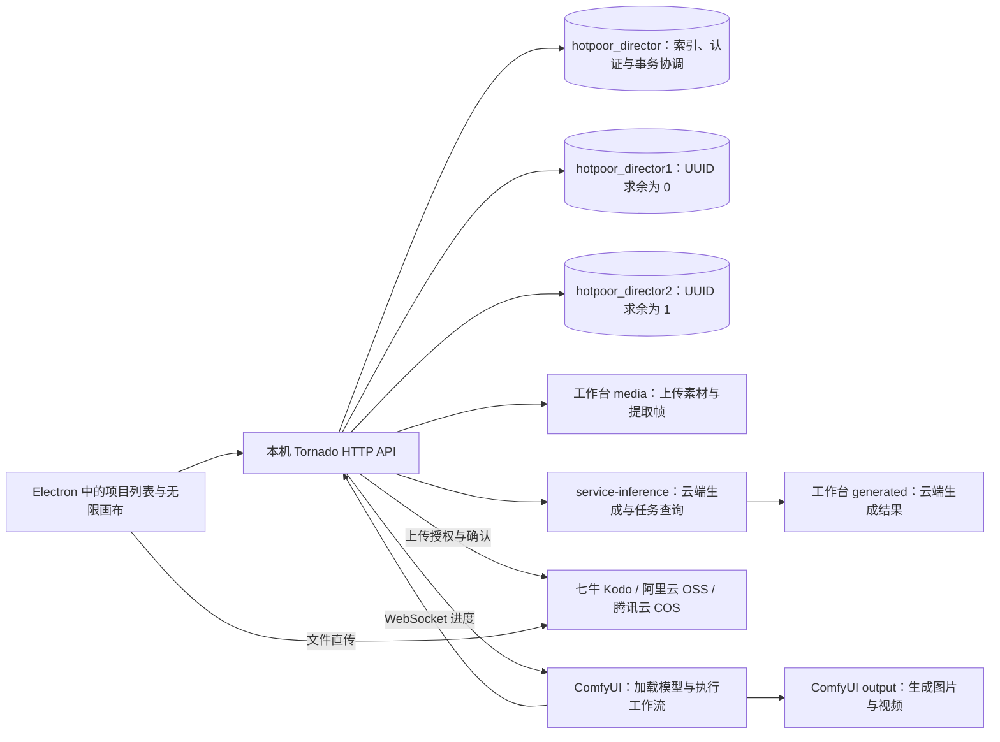

# Hotpoor Director 部署与工作原理

供首次使用者和代码助手阅读。在执行操作前确认当前目录是本仓库，以当前源码和 [README](README.md) 为准；不要把开发者机器的盘符、账号或硬件当作部署要求。默认运行源码 Electron，不构建安装 EXE。只有用户明确需要分发安装包时，才使用 README 中的构建流程。

## 首次部署：Windows x64

当前主要验证平台为 Windows x64。准备 Git、Python 3.12、Node.js 22.12+、Microsoft Visual C++ x64 运行库，以及安装依赖所需的网络连接。ComfyUI 的 Python 环境和本项目 `.venv` 分开使用。

在 PowerShell 中执行：

```powershell
git clone https://github.com/hotpoor/hotpoor_director.git
cd hotpoor_director
powershell -ExecutionPolicy Bypass -File scripts/setup.ps1
npm run dev
```

- `scripts/setup.ps1` 创建 `.venv`、安装 Python 依赖、下载 PostgreSQL 二进制、执行 `npm ci` 并初始化数据库。它不安装 ComfyUI，也不下载模型。
- Python 不在 PATH 时，用 `scripts/setup.ps1 -Python '实际的 python.exe 路径'`。不要使用开发者机器上的路径。
- 首次桌面启动按页面提示创建自己的账号，密码长度 12–256 个字符。没有共享默认账号。需要额外账号时使用交互命令 `npm run user:create`。
- 安装完成后可双击 `Start_Dev.bat`，或运行 `npm run dev` / `npm start`。这些命令直接启动源码，不生成应用安装包。
- Web 文件保存后自动刷新，F12 打开开发工具。修改 Python 或 Electron 主进程后，正常关闭工作台再启动，等待它完成保存及数据库关闭。

若机器已有本项目环境，先检查 `.venv`、`node_modules`、`runtime/pgsql` 和现有数据目录，避免把“修复启动”变成重建数据库。

## 连接 ComfyUI

ComfyUI 是独立运行的推理服务。先在目标机器安装并启动兼容版本的 ComfyUI，按所用模型准备权重及节点；本仓库不携带模型。当前支持的模型和模式见 [README 的本地生成部分](README.md#本地生成)，具体文件名和节点以 [generation.py](backend/generation.py) 与 [LTX 工作流](backend/workflows/ltx25.json) 为准。

登录工作台，在项目列表右上角打开 **ComfyUI 配置**：

1. 填写 Host 和 Port，本机默认 `127.0.0.1`、`8188`；Host 只填主机名或 IP，不含协议、路径或账号。
2. 点击“测试连接”，确认目标返回 ComfyUI 服务信息。测试不会保存。
3. 点击“保存配置”，验证成功后立即生效，重启工作台后仍保留。

配置供此电脑的所有项目共用，目前使用 HTTP 和对应的 WebSocket，不提供 HTTPS、反向代理路径或 API Key 配置。有未结束的工作台生成任务时不能切换地址；连接失败保留原配置。局域网连接可在 ComfyUI 原命令增加 `--listen 0.0.0.0 --port 8188`，待队列空闲后重启，并按专用网络、LocalSubnet 和实际网卡配置防火墙；不做公网端口映射。队列排序扩展仅接受回环请求，远程工作台暂不支持排序；本机回环地址不受路由器分配 IP 变化影响。

模型列表表示工作台已实现的工作流能力，不等于目标 ComfyUI 已安装所有权重。先用目标模型的低尺寸、短时长任务验证，不能只凭连接成功就判断模型可生成。

要启用汇总队列拖动排序，在 **ComfyUI 所在机器** 安装本仓库扩展：

```powershell
.\.venv\Scripts\python.exe scripts/install-queue-extension.py '实际的 ComfyUI 根目录'
```

等 ComfyUI 运行和等待队列都为空后再重启该服务。扩展源码在 [comfy_extensions/director_queue](comfy_extensions/director_queue)；没有扩展时不能排序，但查看队列和按任务停止仍可使用。该安装命令不会安装模型。

## service-inference 云端生成

配置和维护云端生成时，先读 [README 的云端生成说明](README.md#service-inference-云端图片与视频生成) 及 [多 Key 管理](README.md#多-service-inference-key)；实际模型、参数和请求逻辑以 [inference_models.py](backend/inference_models.py) 与 [inference.py](backend/inference.py) 为准。

- 项目列表右上角 **service-inference 设置** 可添加和命名多个 API Key，单选一个供新任务使用。保存、切换和刷新模型会查询该 Key 的 `/v1/models`；卡片只能选择账号可见且工作台已接入的模型。旧卡片的不可用模型保留显示并禁用生成，不自动替换创作参数。
- 任务绑定提交时的 `credential_id`；切换 Key 不影响已有任务。被未结束任务引用的 Key 不能替换或删除；检查活动任务需要扫描两个实体分片。
- 云端图片、视频请求均由后端发出；无需启动本地 ComfyUI。参考素材必须是云端可访问的公网直链，可通过下节的云存储直传获得；本地文件路径和内网 ComfyUI URL 不能直接作为云端参考。
- 图片请求在后台同步执行；视频保存 `remote_task_id` 后轮询，重启继续查询已有 ID。提交超时或提交期间退出时先到服务控制台核对，不自动重发生成请求。当前工作台没有云任务取消或排序接口，不套用 ComfyUI 的取消操作。
- 结果下载到有效数据目录 `generated/`，通过工作台鉴权接口提供预览和视频 Range 播放。`kind=generation` 记录按自身 `block_id` 求余存入实体分片；密钥保存在隐藏配置文件，不写入实体正文、画布或日志。用量字段保留服务端原值。

## 云存储直传

配置和排查时，先读 [README 的直传说明](README.md#云存储直传) 与 [同厂商多配置](README.md#云存储多配置列表)，实现入口为 [cloud_storage.py](backend/cloud_storage.py)。

- 支持七牛 Kodo、阿里云 OSS、腾讯云 COS，同一厂商可保存多套具名配置。每套配置独立维护凭据、Bucket、地域、Endpoint、访问域名及路径前缀；七牛需填写绑定的公网域名。
- **仅保存**不改变当前启用项；单选或**保存并启用**影响后续上传。上传记录绑定原 `profile_id` 和连接配置指纹，切换启用项不影响原上传确认；修改原连接参数或删除原配置后，尚未确认的上传需恢复配置再重试。删除本机配置不会删除云端对象。
- 文件从 Electron 渲染器直接发往对象存储。后端签发 10 分钟单对象上传凭证，随后核对对象元信息与公网访问；长期密钥只在后端。空间验证成功不等于 CORS 和公网域名可用，需分别核对 Bucket 跨域规则及云端获取素材的权限。
- 新对象按 `<前缀>/<项目 block_id>/<文件 MD5>.<扩展名>` 命名；同项目、同存储配置下的相同内容可复用已完成记录。目录中的项目 ID 与记录分片依据不同：`kind=cloud_upload` 按上传记录自身 `block_id` 求余路由，不能按项目 ID 或固定业务库选择数据库。
- 上传完成且确认通过后，才作为可用素材返回公网 URL；仅确认失败时重新确认已有对象。云素材卡片、评论附件和云生成参考均可使用直传结果。现有 URL、云端文件和配置凭据不会随实体分库迁移而移动。

## 系统如何协作



| 部分 | 实现与职责 |
| --- | --- |
| Electron | `desktop/main.cjs` 启动 Python 子进程，读取后端实际端口并加载页面；默认不直接让页面访问文件系统。 |
| Tornado | `backend/server.py`、`backend/workspace.py` 提供登录、私有项目与素材接口；HTTP 只绑定 `127.0.0.1`，桌面端口动态分配，不是 ComfyUI 的 8188。 |
| PostgreSQL | `backend/config.py`、`backend/postgres.py`、`backend/database.py` 管理配置、数据库生命周期和初始化；默认使用内置二进制及 55432 端口，也支持配置外部实例。 |
| 生成适配 | `backend/generation.py` 根据模型和模式构造固定工作流，上传参考素材并提交到 ComfyUI，不接受浏览器提供的任意工作流。 |
| 云端生成 | `backend/inference.py`、`backend/inference_models.py` 管理多 Key、模型发现、云任务提交与恢复及结果下载。 |
| 云存储 | `backend/cloud_storage.py` 管理多配置、短时上传凭证和对象确认；文件由渲染器直传。 |
| 进度 | `backend/progress.py` 通过 WebSocket 接收实际执行与采样事件；百分比反映采样阶段，不能等同于整个任务剩余时间。 |
| 前端 | `backend/web/studio.js` 管理项目、画布、卡片、连线、历史和队列；`preview.js` 管理图片放大及复制。 |

三个数据库位于同一实例，是逻辑分库，**不是读写分离或主从复制**。主库作为索引库，包含 `index_login`、`auth_credentials`、`auth_sessions` 和跨库事务提交决定 `index_entity_commits`；另外两个库各有一张 `entities` 表，按 `int(block_id, 16) % 2` 分配（0 → director1，1 → director2），通过 JSONB 的 `kind` 区分数据。实体查询与写入必须经过 `backend.entities.EntityStore`，不能按业务类型选库。旧数据在初始化时备份并迁移，跨库写入使用可恢复的两阶段提交；内置 PostgreSQL 自动启用 `max_prepared_transactions=32`。

`block_id` / `user_id` 使用 32 位小写十六进制 UUID，无连字符。创建与更新时间为 BIGINT Unix 毫秒，数据库触发器维护更新时间。结构定义见 [backend/schema](backend/schema)。登录密码为 Argon2id 哈希；随机会话令牌以 SHA-256 保存。私有接口检查用户归属，写请求有 XSRF 校验。

一次本地 ComfyUI 生成的流程：自动保存画布 → 校验模型、尺寸和参考素材 → 创建生成记录 → 上传或预处理参考素材 → ComfyUI 入队 → 加载模型及编码输入 → 采样 → 解码、编码视频及保存输出 → 工作台同步历史。实时等待计时包含提交和排队；历史耗时依据实际执行事件计算。模型没有提供 token 用量时保持未提供，不估造数值。

画布 JSON 保存卡片位置、尺寸、各模式参数、PIN、连线和历史选择。前端约 700ms 防抖自动保存，使用 revision 检查多窗口冲突。遇到冲突先保留或导出草稿，不直接覆盖另一窗口的修改。

## 数据在哪里，如何保留

先确认有效数据目录，不要凭目录名称推断。`DIRECTOR_DATA_DIR` 优先；源码开发通常使用仓库 `.local`，已有桌面数据时可能继续使用 Electron 的 `userData`。Windows 本机常见位置为 `%APPDATA%/hotpoor-director`。选择逻辑见 `desktop/main.cjs` 和 `backend/config.py`。

| 文件或目录 | 内容 |
| --- | --- |
| 数据目录 `config.json` | 数据库连接凭据、cookie secret；初次运行自动生成。`config.example.json` 仅展示结构，不可把示例占位值当成真实密码。 |
| 数据目录 `.comfyui.json` | Host / Port，本机隐藏连接配置；不与账号配置混写。 |
| 数据目录 `.service-inference.json` | 多 API Key、当前启用项及模型发现信息；不回显凭据，不提交到 Git。 |
| 数据目录 `.cloud-storage.json` | 云存储多套配置、长期密钥及启用状态；不回显凭据，不提交到 Git。 |
| 数据目录 `generated/` | 下载到本机的云端生成图片和视频；备份项目时一并保留。 |
| 云存储 Bucket | 直传素材原文件；数据库保存引用与元信息，备份本机目录不包含这些远端对象。 |
| 数据目录 `postgres/` | 内置 PostgreSQL 实际数据。外部数据库由其管理员维护。 |
| 数据目录 `media/` | 上传图片、视频、音频及提取帧等素材文件。数据库记录元信息，不把完整文件存入 JSONB。 |
| ComfyUI 模型目录 | 推理权重，独立于工作台。可通过 ComfyUI 原生 `extra_model_paths.yaml` 指向 SSD。 |
| ComfyUI `output/` | 原始生成结果。生成记录保存输出信息和生成时的服务地址；改连接配置不搬迁旧结果，原服务仍需可访问。 |

Git clone 只获得代码、Logo/图标、建表脚本和示例配置，不获得他人的账号、数据库、素材或模型。`.local/`、`.test-data/`、`.secrets/`、`runtime/`、依赖目录均被忽略。提交前检查 `git status` 和暂存差异，不依赖文件名前有点号就认为安全。

备份需要同时考虑数据库、工作台素材、配置及 ComfyUI 输出。运行中的 PostgreSQL 用正规数据库备份工具；文件级复制应先正常关闭数据库。修改模型路径不要求重装工作台；复制后核对大小与 SHA256，验证解析到目标目录，再按用户授权决定是否删除旧副本。现有 [SSD 迁移记录](docs/SSD-MIGRATION.md) 只是开发机器案例，不是他人部署路径。

## 排查与验证

| 症状 | 优先检查 |
| --- | --- |
| Electron 启动后退出 | `.venv`、Python 依赖、`node_modules`、PostgreSQL 二进制及 VC++ 运行库；从终端启动查看错误。不要以删除数据目录排错。 |
| PostgreSQL 无法启动 | 数据目录权限、55432 端口冲突、配置模式与实际服务；正常退出可能需要等待磁盘刷新。 |
| ComfyUI 连接失败 | 目标服务是否启动、Host/Port、局域网监听和访问权限；不要误填 Tornado 的动态端口。 |
| 在线但生成失败 | 缺失的模型文件、节点版本、显存、尺寸或工作流错误；检查 ComfyUI 日志与 `/object_info`。 |
| 看不到进度或长时间等待 | 分清排队、加载权重、采样及输出编码；WebSocket 是否可连。不要因暂时没有采样百分比而重复提交。 |
| 历史图片或视频打不开 | 对应生成时服务和输出文件是否仍存在；修改连接配置不会把旧文件复制到新服务。 |
| 云端模型不可选 | 当前 Key 的模型发现结果、工作台接入范围及该 Key 是否有效；不要改写旧卡片参数绕过检查。 |
| 云端任务重开后异常 | 原 Key、绑定的远端任务 ID、控制台受理状态及本机 `generated/` 文件；不要重复提交未确认的任务。 |
| 云存储验证通过但上传失败 | Bucket 的 CORS、上传权限、地域和 Endpoint；空间验证不执行真实上传。 |
| 文件已上传但确认失败 | 原配置 ID 和指纹、公网域名、对象大小与访问权限；优先重试确认。 |
| 队列不能排序 | `director_queue` 扩展是否在目标服务安装并加载；排序冲突时刷新真实队列，不删除后重新提交。 |

代码改动按影响范围验证。`npm test` 使用隔离测试数据验证后端；`node_modules/.bin/electron.cmd scripts/smoke-comfy-settings.cjs` 可验证连接配置界面。云端与存储后端测试见 `tests/test_inference.py`、`tests/test_cloud_storage.py`；`scripts/smoke-inference.cjs` 使用隔离数据和模拟响应验证云端生成界面。其他测试入口见 `scripts/smoke-*.cjs`、`scripts/smoke-*.py`。实际 GPU 生成测试会消耗资源，只在用户授权且队列空闲时运行。不要把测试数据目录换成用户正在使用的数据目录。

部署完成至少确认：源码窗口能启动、用户能登录或完成首次设置、项目重开后保存内容仍在，以及本次选用服务的只读连接检查通过；本地生成检查 ComfyUI，云端生成检查 Key 与模型发现，素材直传检查所选存储配置。若本次包含模型安装，再验证对应模型实际生成与历史回看。报告已验证范围和仍缺少的权重或运行条件。

维护改动时更新 [开发日志](DEVELOPMENT_LOG.md)。提交、推送与目标分支遵循当前使用者的授权，不把本文视为自动发布或重置数据的许可。
